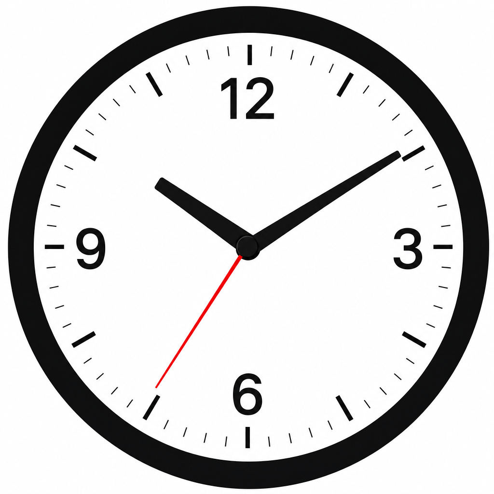
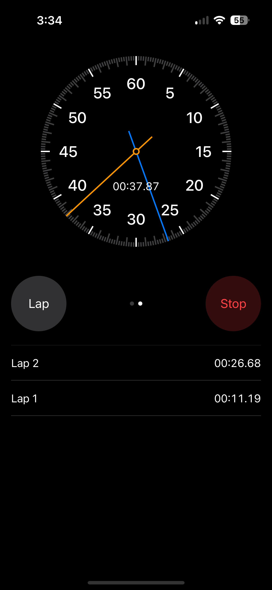
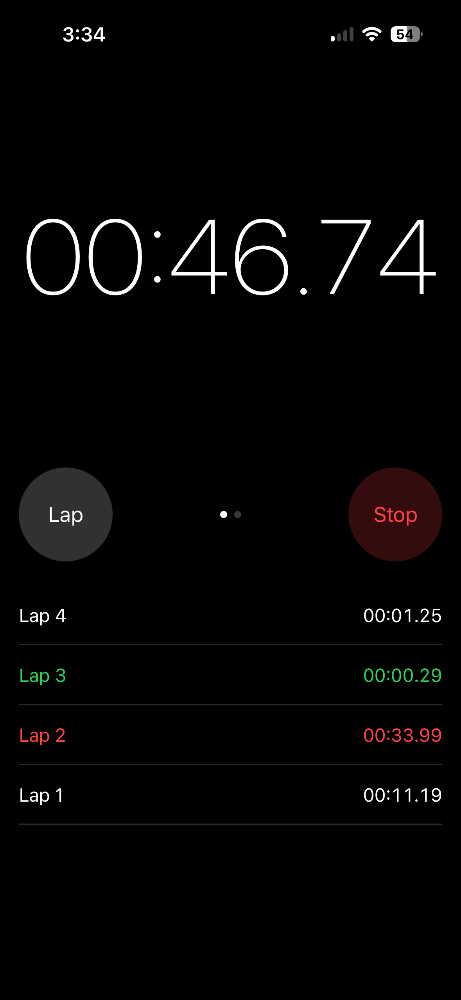
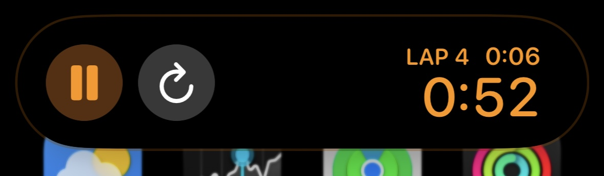

<p align="center">
  
</p>

<h1 align="center">ClockApp</h1>

<p align="center">
  
  
  
  
  
</p>

Stopwatch app with analog/digital faces, lap list, and interactive Live Activities (Dynamic Island + Lock Screen).

## Screenshots

<p align="center">
  
  &nbsp;
  
</p>

<p align="center">
  
</p>

<p align="center">
  
  &nbsp;
  
</p>

## Architecture

There is no single in-memory store across processes. The app and Live Activity extension are separate targets; they share a schema and sync snapshots.

| Surface | Source of truth |
| --- | --- |
| App UI (foreground) | `StopwatchViewModel` (`@Observable`) |
| Island / Lock Screen | `Activity` `ContentState` (`StopwatchAttributes`) |
| Shared schema | `StopwatchAttributes.ContentState` in `Shared/` |

```
App actions  -->  ViewModel  --sync-->  Activity ContentState
Island / Lock Screen intents  -->  ContentState
App becomes active  -->  restore(from: ContentState)  -->  ViewModel
```

## Background / Live Activity

- **ActivityKit** keeps the stopwatch visible while the app is backgrounded or locked.
- Running time uses `Text(timerInterval:)` so the system advances seconds without a custom high-frequency timer in the extension.
- Island / Lock Screen buttons are `LiveActivityIntent`s (`Toggle` / `Lap` / `Reset`). The system wakes the app process, runs `perform()`, then updates the Activity. A short tap delay is normal for third-party Live Activities.
- `StopwatchLiveActivityManager` starts/updates/ends the Activity from the ViewModel.
- On `scenePhase == .active`, the app restores from the live Activity (including the full `laps` array) so the analog blue lap hand and lap list match island actions.

## Project layout

```
ClockApp/                 Main app
  Models/                 StopwatchViewModel, LiveActivityManager
  Views/                  ClockView
  Views/Components/       UI building blocks
Shared/                   Compiled into app + widget extension
  StopwatchAttributes.swift
  StopwatchLiveActivityIntents.swift
  StopwatchLiveActivityActions.swift
ClockWiget/               Widget extension + Live Activity UI
doc/                      Logo and UI screenshots
```

`Shared/` is required so both targets share the Activity attributes, intents, and mutation helpers. It is not a separate framework.

## UI components

| Component | Role |
| --- | --- |
| `ClockDisplayView` | Paged analog / digital face |
| `AnalogClockFace` | Orange second hand; blue lap hand when `laps` is non-empty |
| `DigitalClockFace` | Monospaced digital readout |
| `ControlButtonsView` | Start / stop / lap / reset + face switch |
| `LapListView` | Lap history + live current lap |
| `PageIndicatorDots` | Face page indicator |

Root UI is forced dark via `.preferredColorScheme(.dark)`.

## Sync notes

- `liveActivityState()` pushes ViewModel → Activity (`laps`, `lapMark`, running/paused timing).
- Island lap appends to `ContentState.laps` and refreshes `lapCount` / `lastLapDuration`.
- `restore(from:)` copies Activity state into the ViewModel when the app returns to foreground.
- Intent taps can feel delayed; that is system App Intent / Live Activity latency, not intentional app throttling.
